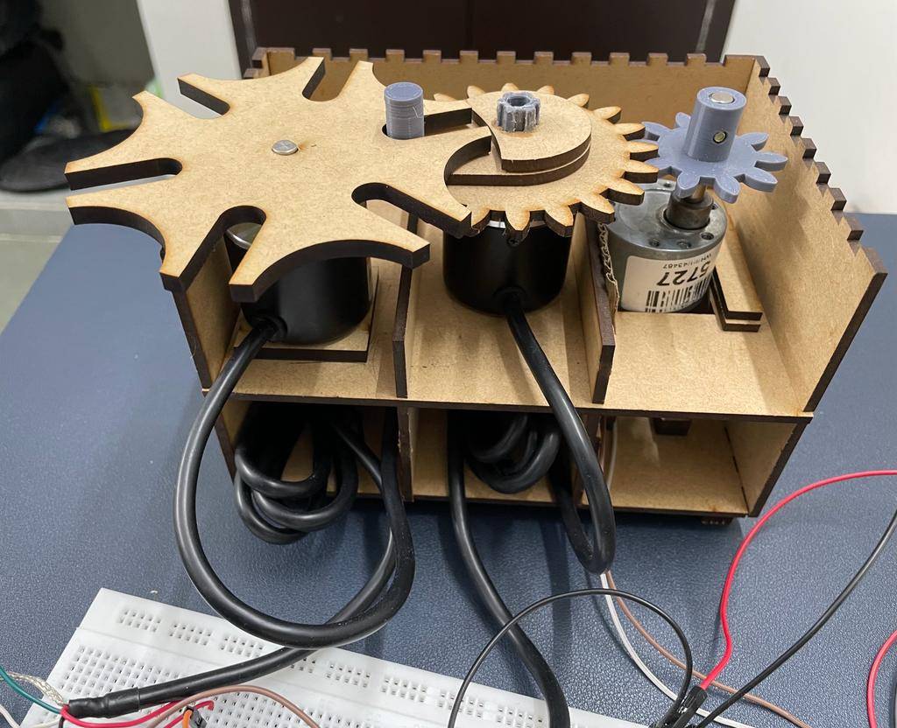
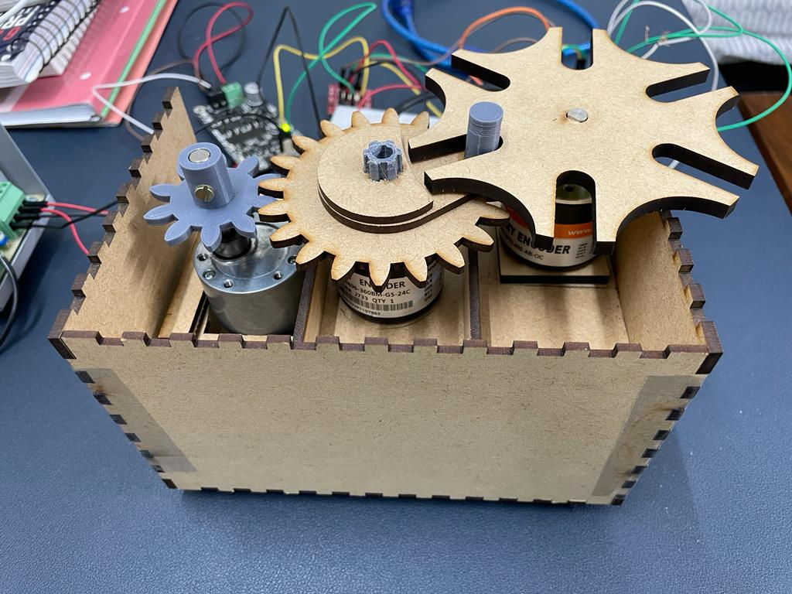

# Geneva_Wheel
Designed a Geneva wheel having a dwell time of 20sec and index time of 10sec. 
Experimented in course ME 351 (2023), IIT Gandhinagar.

### 1. CAD design
Designed CAD model for components in Autodesk Fusion 360

  

### 2. Manufacturing
Components manufactured using 3D printing and Laser cutting
### 3. Electrical Components
A 12V DC motor (200 rpm) rotates the Driver wheel.
An optical encoder is used to measure the angular velocity of the Geneva wheel.
