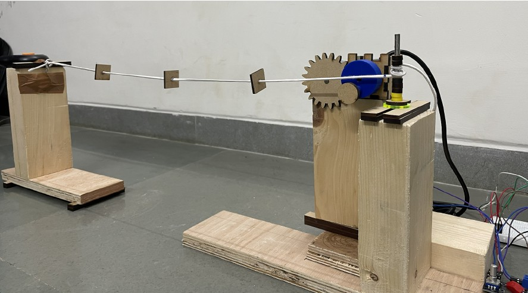
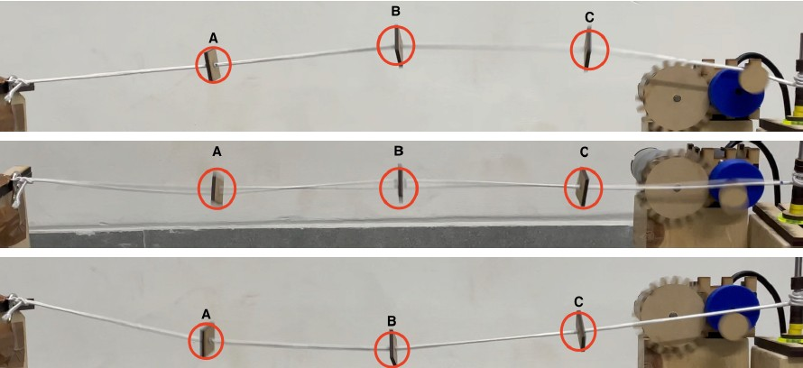
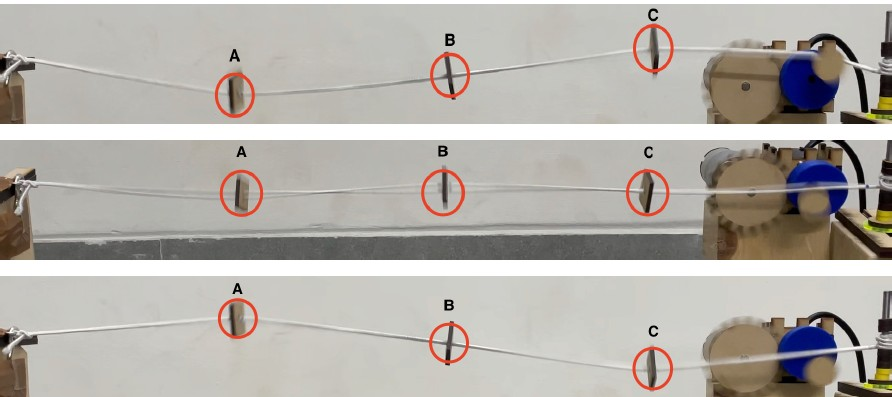
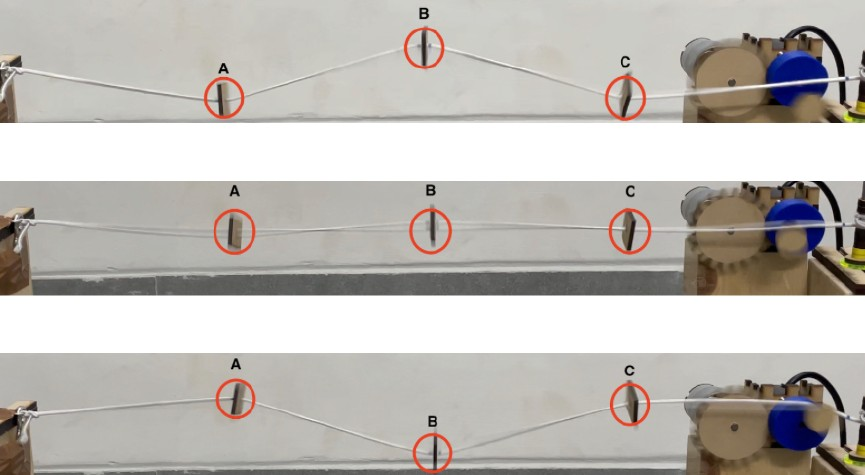

# Modes_Of_Vibration_3DOF_System
Experimented in course ME 351 (2023), IIT Gandhinagar.

This project explores the modes of vibration in a **three-degree-of-freedom (3DOF) system**, demonstrating how three bead masses attached to strings oscillate under different conditions.

---

## 📌 Introduction
In structural dynamics, a **3DOF system** consists of three masses interconnected by elastic elements, allowing for multiple modes of vibration. This setup helps in understanding **natural frequencies, mode shapes, and system behavior under excitation**.

---

## 🖼 System Representation

### **1️⃣ Bead Masses Attached to Strings**
This setup consists of three bead masses connected by strings, allowing free movement in response to applied forces.

---

## 📊 Modes of Vibration
The system exhibits **three fundamental vibration modes**:
1. **Mode 1:** All masses move in phase.

   
   
2. **Mode 2:** Middle mass moves opposite to outer masses.
   
   
   
3. **Mode 3:** Complex movement with alternating displacements.
   
   

Understanding these modes is essential in applications like **seismic analysis, vehicle suspension systems, and structural engineering**.

---

📌 *For more details, check the video and theoretical calculations included in this repository!* 🚀

### 1. CAD design
Designed CAD model for components in Autodesk Fusion 360
### 2. Manufacturing
Components manufactured using 3D printing and Laser cutting
### 3. Electrical Components
Used rotary encoder to control the RPM of 12V DC motor.
An optical encoder is used to get the RPM of the eccentric shaft.
Used Arduino UNO to control it.
### 4. Video uploaded on You-Tube 
Link - https://youtu.be/O6W6XLKvcoo

