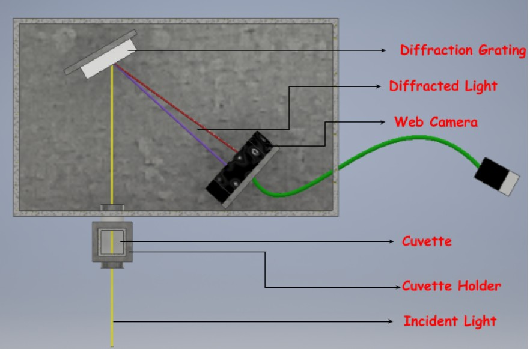
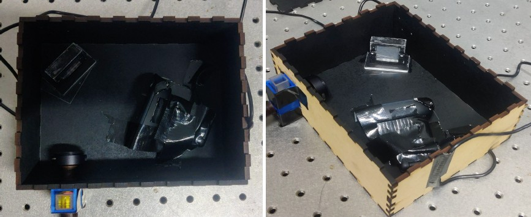

# Spectrometer
Project in course BS 191 (2022), IIT Gandhinagar.

### 1. CAD design
Designed CAD models for components in Autodesk Fusion 360 and Autodesk Inventor 2018 Professional.

### 2. Manufacturing
Components manufactured using 3D printing and Laser cutting.

### 3. Components
1) Web camera - (Logitech C270 Digital HD Webcam)
2) Diffraction grating
3) Cuvette
4) Optical Fibre
